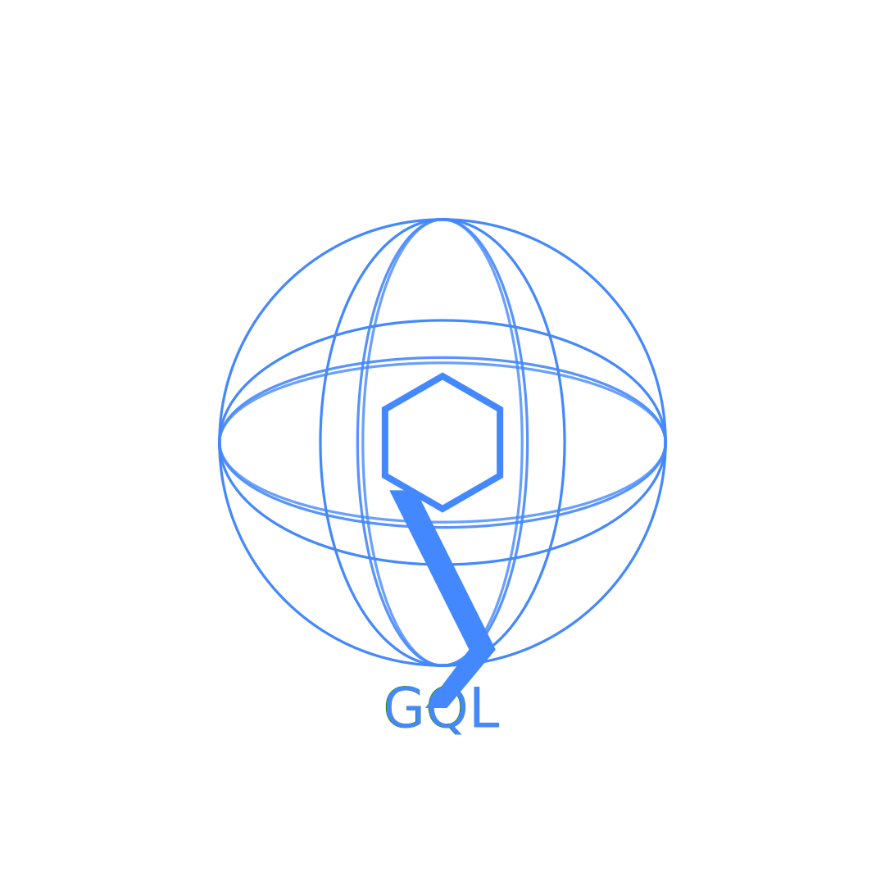

    

# GQL

Get Graph Query Language with PowerShell.

GQL is a small PowerShell module for GraphQL.

It is designed to provide a simple GraphQL client in PowerShell.

We can use this as a direct client to GraphQL, without having to involve any other layer.

## GQL Container

You can use the GQL module within a container:

~~~powershell
docker pull ghcr.io/powershellweb/gql
docker run -it ghcr.io/powershellweb/gql
~~~

### Installing and Importing

~~~PowerShell
Install-Module GQL -Scope CurrentUser -Force
Import-Module GQL -Force -PassThru
~~~

### Get-GQL

To connect to a GQL and get results, use [Get-GQL](Get-GQL.md), or, simply `GQL`.

(like all functions in PowerShell, it is case-insensitive)

### More Examples

~~~PipeScript{
Import-Module .\ 
Get-Help Get-GQL | 
    %{ $_.Examples.Example.code} |
    % -Begin { $exampleCount = 0 } -Process {
        $exampleCount++
        @(
            "#### Get-GQL Example $exampleCount" 
            ''         
            "~~~powershell"
            $_
            "~~~"
            ''
        ) -join [Environment]::Newline
    }
}
~~~